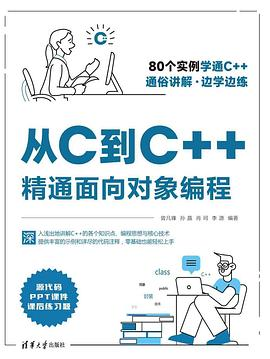

## About This Book

<!--  -->

- Title: 从C到C++精通面向对象编程
- Links: [douban](https://book.douban.com/subject/36175277/)
- ISBN: 9787302619550

## What I Contributed For This Book?

I composed Chapter 11 of this book autonomously (including content and example code): 

- 第11章 C++11 225
  - 11.1 C++11简介 225
  - 11.2 C++11新特性 226
    - 11.2.1 auto类型推断 226
    - 11.2.2 decltype类型推断 226
    - 11.2.3 初始化列表 227
    - 11.2.4 Lambda表达式 227
    - 11.2.5 连续右尖括号的改进 228
    - 11.2.6 基于范围的for循环 228
    - 11.2.7 可变参数模板 229
    - 11.2.8 nullptr 230
    - 11.2.9 右值引用 230
    - 11.2.10 显式生成默认函数与显式删除函数 230
    - 11.2.11 override和final 231
    - 11.2.12 智能指针 231
    - 11.2.13 tuple 231
  - 11.3 C++11示例 232
  - 11.4 本章小结 234
- 本章习题 234

## Preview

<embed src="https://davidlee528.github.io/files/miscs/Hyper-Realistic%20MetaHuman%20-%20The%20Bridge%20to%20the%20Metaverse%20in%20Web%203.0.pdf#toolbar=0&navpanes=0&scrollbar=0&view=fitH" type="application/pdf" width="100%" height="75px" />

