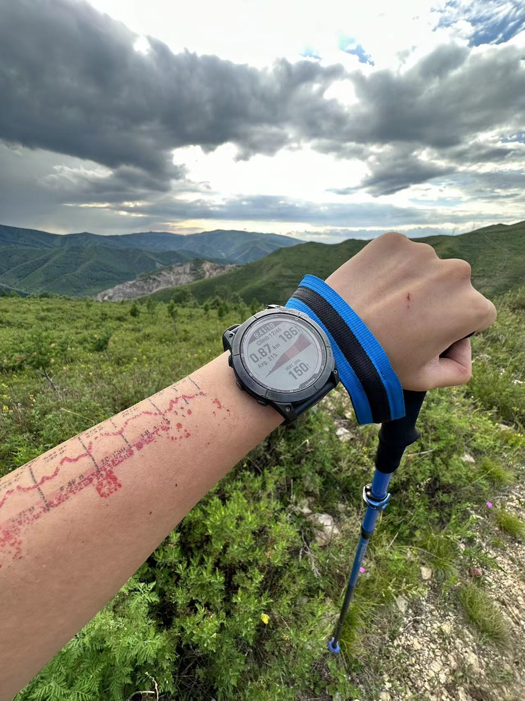
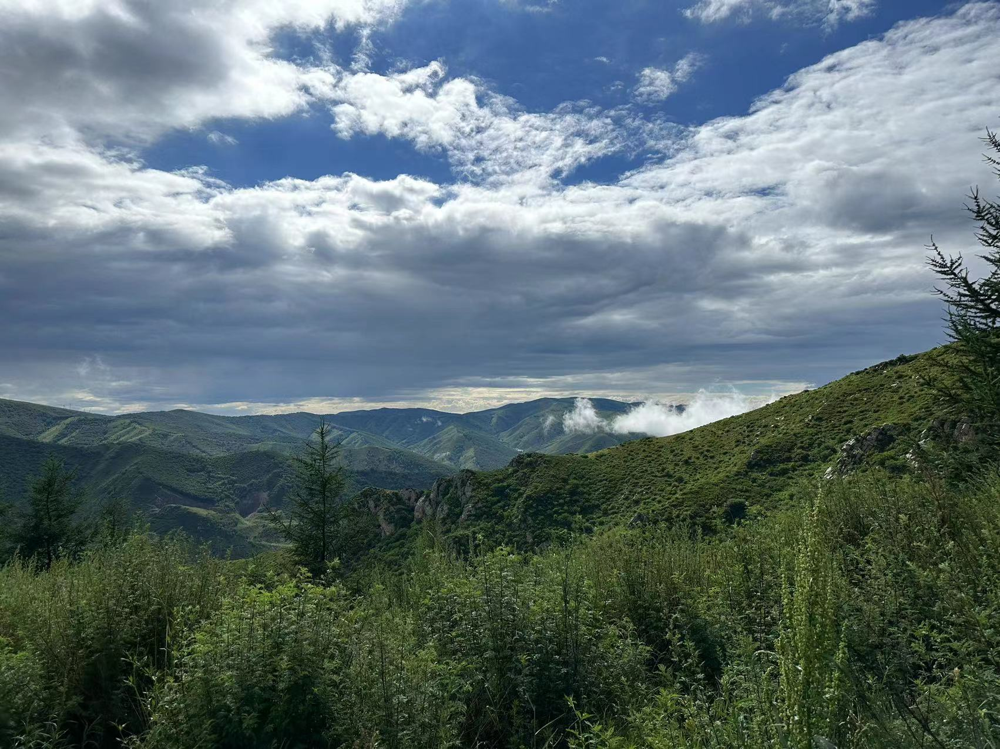
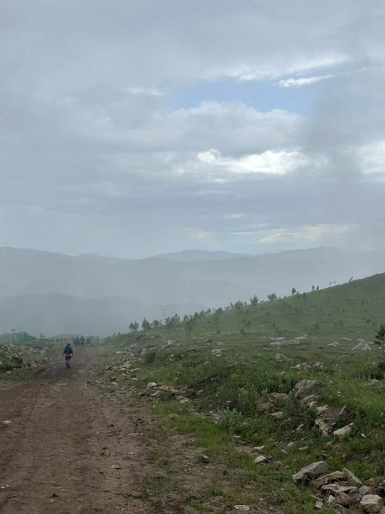
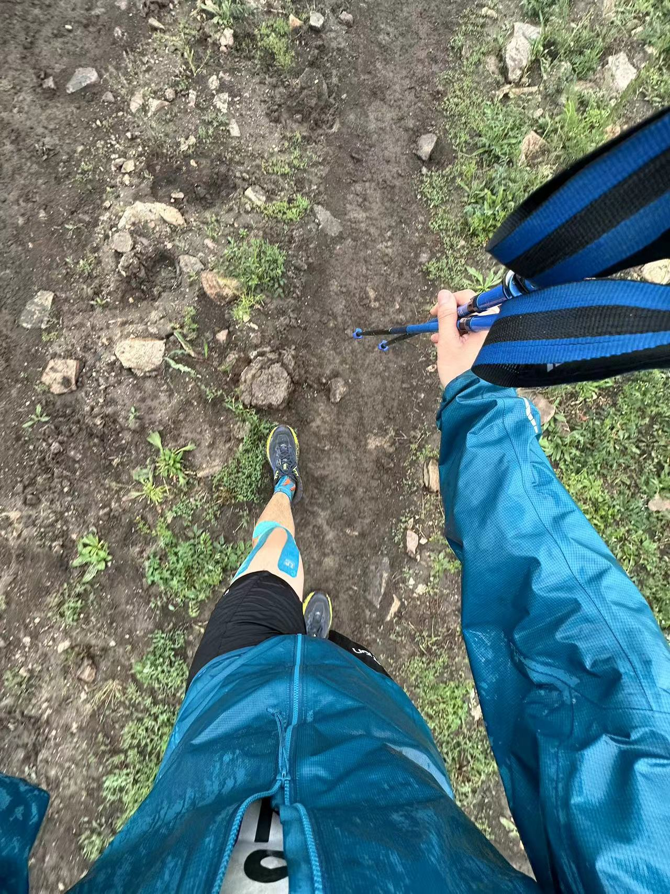
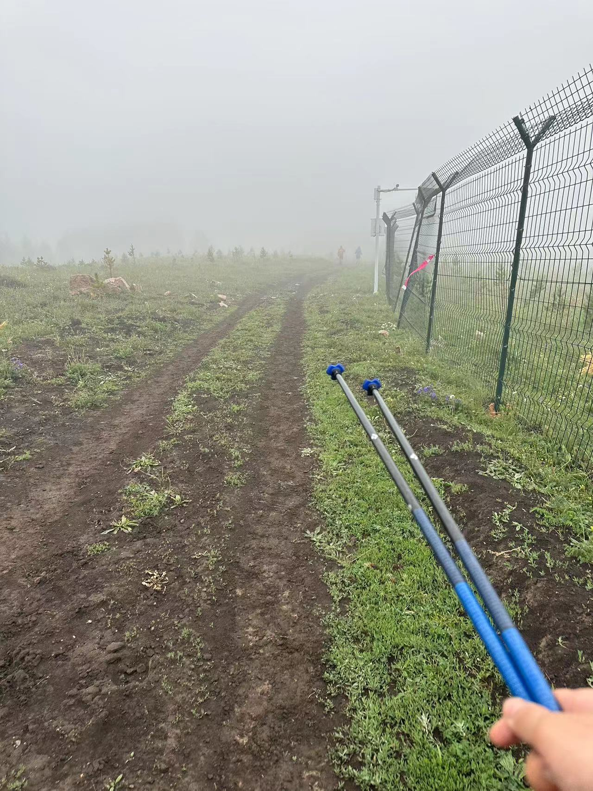
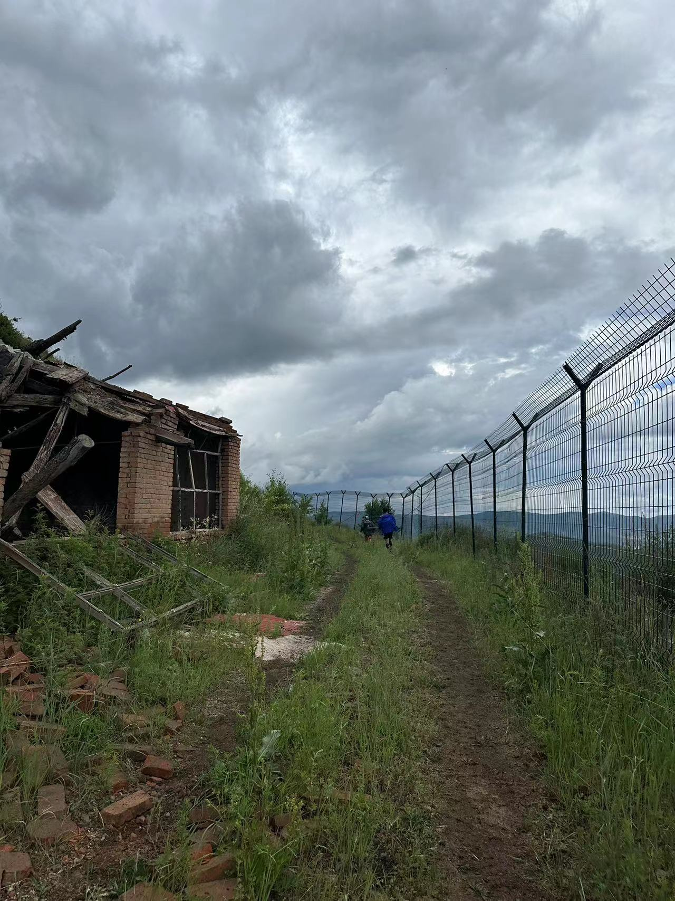
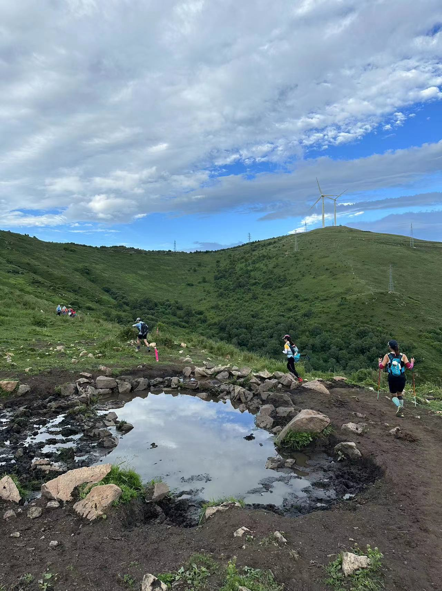

安全完赛2023崇礼168越野赛（DTC百公里组），手表记录水平移动105.0km，累计爬升5458m，ITRA积分+=4。平时有运动基础的话，赛前两天吃好喝好，百公里其实没那么遥不可及。最后很感谢几位带我的大哥大姐，没你们我真很难独立完赛，尤其是很难熬过折磨人的夜晚，没来得及全部合影还有点遗憾。

这是我第一次参加越野跑比赛，其实按理来说是不能参加DTC百公里组别的，因为报名该组别需要以前的完赛证书（比如MTC七十公里组完赛证书）作为申请报名材料，证明你有能力安全完赛。报名的时候发现有一个DTC公益组的选项，费用稍高，但无需任何完赛经验，遂报名。

赛程比较长，有足足105公里，我是新手小白，故耗时一天以上，所以比赛过程还是比较熬人的。在每个检查点，我几乎是卡着关门时间前几十分钟进站完成打卡的。在路上，尤其是后半程，总是能听见不知道哪冒出来的人说：“没戏了，没戏了，离下个检查站还有xx公里，时间就剩xx分钟了......”。对于这种言论，我是一向不理睬的，但到了最为艰难的后半程，听到这种话，心中难免会对能否完赛这件事产生质疑，还好最后还是坚持下来了。

由于经验的缺失，在能量补给方面严重欠缺。别人的百公里赛事一般会准备20支以上的能量胶，用于补给站之外的快速能量补充。而我呢？只带了两支。在80-90KM这一段，明明爬升率不高，路况也比较好，但是由于身体缺乏能量，挪动一步都很困难，体能断崖式下降，突然想起赛前塞在包里的几颗糖，拿出吃了，休息一会儿，才能继续。

下面是一些照片。

装备整理，摄于正赛前夜：

手表记录的比赛基础数据：

手表记录的比赛爬升数据：

DTC100组完赛奖牌，还挺沉的：

认识的朋友（有些朋友没来得及合影）：

拍摄的一些图片：

 

 

 

 

 

 

